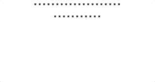

# 02 Sujet pavage

Pour ce projet vous allez utiliser Create React App (CRA) ou le Webpack proposé ci-après pour réaliser cette exercice.

Nous vous conseillons d'utiliser la CRA, pour rester concentrer sur le développement et ne pas passer trop de temps sur de la configuration. Cependant, regardez la configuration du fichier webpack.config.js pour vous familiarisez avec ce type de configuration. La CRA utilise son propre Webpack déjà configurer pour React & ReactDOM.

Repectez la structure miminale de composants suivante :

```text
    App
     .
     .
    Star
```

En vous aidant du life cycle de React créez un pavage dynamique d'étoiles. Chaque ligne doit comporter 20 étoiles.  

1. Dans un premier temps tracez les lignes de 20 étoiles l'une à la suite de l'autre. Vous pouvez les tracez avec un délai que vous choisissez.

2. Maintenant faite en sorte que chaque étoile sur une ligne s'affiche avec un délais de 500ms. Une fois que la ligne comporte 20 étoiles passez à la ligne suivante. Vous devez tracer 10 lignes au total.

3. (Facultatif) Vous utiliserez également Styled-components pour styliser les étoiles et définir plus généralement les styles pour l'application.. 



## annexe Parite 1 CRA

npx est normalement installé si vous avez Node.js sur votre machine. Si vous rencontrez des problèmes d'installation voyez la documentation ci-dessous :

[cra](https://create-react-app.dev/docs/getting-started)

Lancez les commandes suivantes pour avoir la dernière version de la CRA configuré :

```bash
npx create-react-app app-stars
cd app-stars
# Démarre 
npm start 
```

Quelques commandes pratiques :

```bash
# démarre le serveur de production
npm start

# build les sources dossier build
npm run build

# build en supprimant toutes les dépendances inutiles
# Attention pas de retour en arrière possible...
npm run eject
```

### Structure de la CRA en mode développement

```text
app-stars
├── README.md
├── node_modules
├── package.json
├── .gitignore
├── public   <-- les assets statics
│   ├── favicon.ico
│   ├── index.html <-- Point d'entrée de l'application
│   ├── logo192.png
│   ├── logo512.png
│   ├── manifest.json
│   └── robots.txt
└── src
    ├── App.css
    ├── App.js.    <-- Composant racine
    ├── App.test.js
    ├── index.css
    ├── index.js. <-- Bootstrap
    ├── logo.svg
    ├── serviceWorker.js
    └── setupTests.js  <-- tests 
```

## annexe Partie 2 Webpack & React (plus technique)

Vous mettez en place React avec Webpack pour avoir un cadre de travail de développement. 

Créez la structure de dossiers et fichiers suivantes :

```text

--- assets statics  PRODUCTION

public/
    index.html <-- le point d'entrée de l'application
    bundle.js  <-- Un fichier de build JS pour le navigateur

--- partie développement

src/
    App.js     <-- Le code React
    App.css
    index.js   <-- Le bootstrap 
.babelrc       <--  Permet de transcrire le JSX & syntaxe moderne en JS pour les navigateurs 
webpack.config.js <-- fichier de configuration pour le build et reload de React
```

- Installez les dépendances suivantes. Utilisez le modèle dans le dossier MODELS react_webpack et tapez les lignes de commande suivantes à la racine de ce dossier.

```bash
# Initialisation du projet
npm init -y 

# les dépendances React et ReactDOM
npm i react react-dom

# Gestion des styles 
npm i styled-component

# Pour le build et la compilation des JSX ...
npm i webpack webpack-cli webpack-dev-server --save-dev
npm i @babel/core @babel/preset-env @babel/preset-react babel-loader file-loader css-loader style-loader --save-dev
```

Testez l'application en tapant la ligne de commande suivante :

```bash
# Qu'une seule fois pour créer les dossiers de build
npm run build

# Puis lancez le watch et le navigateur
npm run start
```

### Structure de l'application développement et production 

#### Fichiers

- .babelrc

```text
{
    "presets": [
        "@babel/preset-env",
        "@babel/preset-react"
    ]
 }
 ```

- webpack.config.js

 ```js
const path = require("path");
const config = {
  entry: [path.resolve(__dirname, "src/index.js")],
  output: {
    path: path.resolve(__dirname, "public"),
    filename: "bundle.js",
  },
  resolve: {
    extensions: [".js"],
  },
  module: {
    rules: [
      {
        test: /\.(js)$/,
        exclude: /node_modules/,
        use: {
          loader: "babel-loader",
        },
      },
      {
        test: /\.css$/,
        use: ["style-loader", "css-loader"],
      },
    ],
  },
};

module.exports = config;
```

- index.js

Le bootstrap de l'application

```js
import React from "react"
import ReactDom from "react-dom"
import App from "./App"
import "./App.css"

ReactDom.render(<App />, document.getElementById('root'))
```

- App.js 

Vos composants seront développés dans un dossier components sauf le fichier App.js, composant racine de votre application.

```js
import React from "react";

class App extends React.Component {

    render(){

        return(
           <p>Hello React ! </p>
        )
    }
}

export default App;
```
