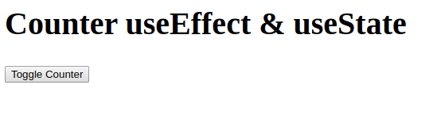
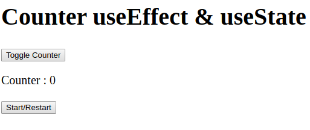
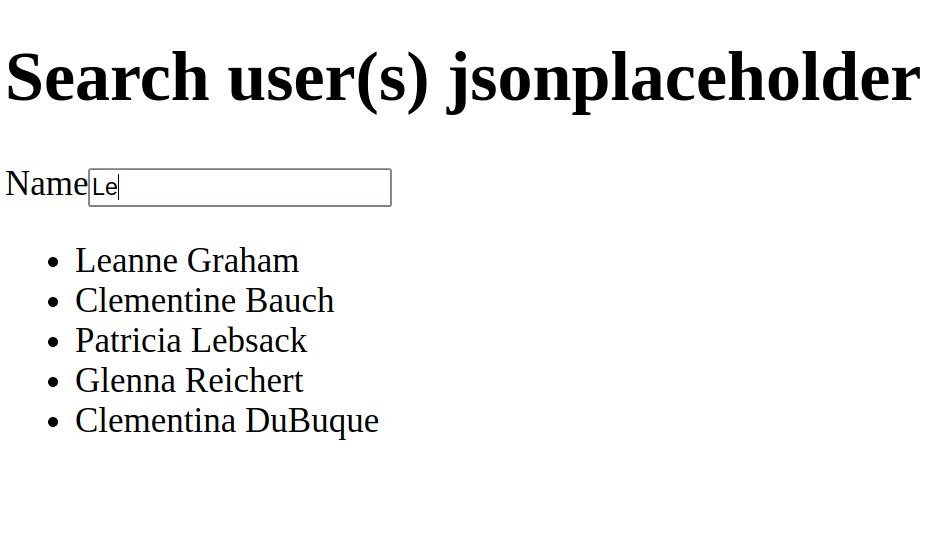
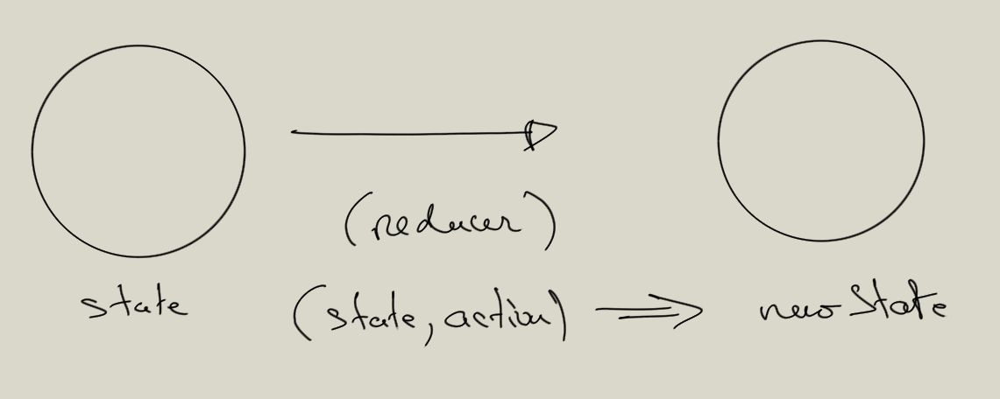

# Les Hooks

Dans ce chapitre nous n'utiliserons pas la CRA systématiquement, mais nous allons appréhender la notion de Hooks dans des fichiers unique. Nous reviendrons à la CRA par la suite.

L'approche fonctionnelle pour définir des composants impose l'utilisation des Hooks pour retrouver les fonctionnalités de React comme la gestion state, le life cycle par exemple.

React à introduit des Hooks depuis la version 16.8.0, ils donnent par exemple la possibilité de gérer les states directement dans une fonction. Les Hooks permettent de rendre le code plus modulable et plus performant.

Les Hooks permettent d'introduire la programmation fonctionnelle.

## Règles pour l'utilisation des Hooks

- Vous ne devez pas appeler les Hooks dans des boucles.

- Vous ne devez pas les appeler dans des if.

- N'appelez pas les Hooks dans des fonctions imbriquées.

- N'appelez pas les Hooks depuis des fonctions JS.

En suivant ces règles, vous garantissez que les Hooks sont appelés dans le même ordre à chaque affichage du composant.

Il existe un plugin qui vous permettra de respecter ces règles lors du développement de votre application :

```bash
npm install eslint-plugin-react-hooks --save-dev
```

Théoriquement dans create-react-app ces règles sont bien vérifiées.

## La gestion du state avec des Hooks

Pour définir les states dans une fonction vous utiliserez useState.

```js

const TestState = (props) =>{
  // Définition du state avec useState 2 paramètres respectivement:
  // 1. Variable pour le state.
  // 2. Fonction qui mettra à jour le state.
  const [count, setCount] = React.useState(0);

  return (
      <div>
        <p>Hello World {count}</p>
        <button onClick={() => setCount(count + 1) } >
          click me
        </button>
      </div>
    );
}

ReactDOM.render(
  <TestState />,
  document.getElementById('root')
);
```

**Avantages:**

Le hook useState permet de définir un state et sa fonction de mise à jour en même temps.

Vous pouvez avoir plusieurs useState par composant.

La fonction setCount est plus simple à appeler.

## useEffect

Vous pouvez gérer le life cycle à l'aide du hook **useEffect**. Ce dernier sera exécuté lors du **montage** de l'élément dans le DOM et lorsque les ou un state (spécifique) **sera/sont modifié(s)**. Ce hook possède également une fonction dite de nettoyage qui pourra être exécutée dans le cas où le composant est démonté du DOM.

Le useEffect factorise les trois fonctions du life cycle suivantes : **componentDidMount**, **componentDidUpdate** et **componentWillUnmount**.

Voyez l'exemple qui suit :

```js
const Counter = () => {
  const [count, setCount] = React.useState(0);

  // Au montage la première fois.
  // Et dès que le state change.
  React.useEffect(() => {
    setTimeout(() => {
      console.log(`First message: You clicked ${count} times`);
    }, 1000);
  });

  // Au montage la première fois.
  // Dès que le state change.
  React.useEffect(() => {
    setTimeout(() => {
      console.log(`Second message: You clicked ${count} times`);
    }, 1000);
  });

  return (
    <div>
      <p>You clicked {count} times</p>
      <button onClick={() => setCount(count + 1)}>
        Click me
      </button>
    </div>
  );
}
```

**Il y a un inconvénient** à cette approche car dès que l'on modifie le state tous les Hooks useEffects sont appelés.
Pour remédier à ce problème vous pouvez cibler le state en deuxième paramètre de useEffect. Ainsi si un state particulier est modifié on ré-exécute uniquement le code du useEffect concerné :

```js
const Counter = () => {
  const [count1, setCount1] = React.useState(0);
  const [count2, setCount2] = React.useState(0);

  // Au montage uniquement.
  // Puis dès que le state count1 est modifié.
  React.useEffect(() => {
    setTimeout(() => {
      console.log(`First message: You clicked ${count1} times`);
    }, 1000);
  }, [count1]);

  // Au montage uniquement.
  // Puis dès que le state count2 est modifié.
  React.useEffect(() => {
    setTimeout(() => {
      console.log(`Second message: You clicked ${count2} times`);
    }, 1000);
  }, [count2]);

  return (
    <div>
      <p>You clicked {count1} & {count2} times</p>
      <button onClick={() => setCount1(count1 + 1)}>
        First
      </button>
       <button onClick={() => setCount2(count2 + 1)}>
        Second
      </button>
    </div>
  );
}
```

Dans certain cas vous pouvez indiquer à React **de n'exécuter qu'une seule fois**, au montage (après le premier affichage), le code se trouvant dans useEffect. Il faudra alors passer en deuxième paramètre un tableau vide. Cela indique à React que votre **effet** (code dans useEffect) ne dépend d’aucune valeur issue d'un state (local), donc il n’a jamais besoin d’être ré-exécuté...


```js
useEffect(() => {

  // faire quelque chose au montage du composant React
  
}, []);
```

## Fonction de nettoyage de useEffect

Dans la fonction **useEffect** nous pouvons également appeler une méthode pour faire quelque chose lorsque :

- Soit nous démontons le composant du DOM.
- Soit lorsque React nettoie les effets du rendu précédent. Dans ce cas useEffect est lié à une/des variable(s) du state.

Vous pouvez implémenter ces fonctionnalitées en définissant dans le premier paramètre de la fonction useEffect une fonction de retour, voyez l'exemple qui suit :

```js
useEffect(() => {

  return ()=> {
    // à chaque fois que active change de valeur & au démontage du composant
  }  
}, [active]);
```

Si on souhaite exécuter une fonction de nettoyage uniquement au démontage on ne liera pas le useEffect à un state :

```js
useEffect(() => {

  return ()=> {
    // quelque chose uniquement au démontage du composant
  }  
}, []);
```

```js
const Counter = () => {
    const [count, setCount] = React.useState(0);

    React.useEffect(
      () => {
          console.log(`First message: You clicked ${count} times`);
          // Cleanup
          // Lorsqu'on démonte l'élément Counter du DOM.
          // Lorsque React met à jour le state count.
          return () => { console.log('unmount component'); }
    },
      [count]
    );

    return (
      <div>
        <p>You clicked {count} times</p>
        <button onClick={() => setCount(count + 1)}>
          Click me
        </button>
      </div>
    );
  }
```

**Remarque :**

Notez que c'est très pratique par exemple lorsqu'on doit se désabonner d'un service pour éviter les fuites mémoires.

### 01 Exercice Counter V1

En n'utilisant que des Hooks et des fonctions pour définir des composants.

Créez un compteur dans un composant App et y implémenter un bouton toggle qui affichera le compteur :



Après avoir cliquer sur le bouton toggle, affichez le compteur :



Le deuxième bouton start/restart permettra de déclencher le compteur ou de le relancer.

Au démontage du composant Counter, pensez à arrêter le compteur.

Dans useEffect pour récupérer l'état précédent du state utiliser la syntaxe suivante :

```js
  // Dans un useEffect setCount(count + 1) réinitilisera le state
  setCount(count => count + 1)
```

### 02 Exercice Nettoyage (question)

1. Il manque quelque chose dans le code suivant pour que le compteur puisse se déclencher. Corrigez le.

2. Que fais la fonction de nettoyage concrètement ?

```js

const App = () => {
    const [active, setActive] = React.useState(false);
    const [count, setCount] = React.useState(10);
    
    React.useEffect(() => {

        if( active && count > 0 )
            setTimeout(() => {
                setCount(count - 1);
            }, 1000);
        
        /*
            Ce mécanisme optionnel nettoye les effets du rendu. 
            Tout effet (changement des props ou state) peut renvoyer une fonction 
            qui se chargera de son propre nettoyage
        */
        return () => {
            if(count === 1) { 
                setActive(false); 
                setCount(10) ; 
            }
        }
    }, [count]);


    return (
        <div>
            { active === false && <button onClick={() => setActive(true)}>Go</button> }
            <p>{count}</p>
        </div>
    )
}

ReactDOM.render(
    <App />,
    document.getElementById('root')
);
</script>
```

### 03 Exercice API fetch

Vous allez maintenant utiliser l'API fetch de JS pour rechercher des utilisateurs. Utilisez l'url suivante :

```js
const url = `https://jsonplaceholder.typicode.com/users`;
```

- 1. Faites un moteur de recherche, sur le name des users que vous avez récupérez dans la variable users. Dans la partie Search créez un formulaire de recherche : un champ de saisi et un bouton pour lancer la recherche à proprement dite.


La recherche se fera sur le variable name de la variable users.

Vous implémenterez une recherche de votre choix par exemple vous pouvez rechercher dans la variable name de users un nom exacte ou faire une recherche plus large en testant si un caractère est présent dans cette chaîne de caractères. Utilisez la méthode **includes** de JS :


```js
"Bonjour".includes("B") // true
"Bonjour".includes("Bonjour") // true

"Bonjour".includes("X") // false
```

```txt

search : []
[Ok]

```

Une deuxième version de la recherche, faite un autre fichier on vous inspirant de ce que l'on vient de faire pour faire ce deuxième moteur de recherche

2. On voudrait faire un petit moteur de recherche comme suit, en tapant les premières lettres on afficherait le résultat sous le champ de recherche :




Faites les composants fonctionels suivants, le composant Search récupère dans un formulaire la recherche et le composant Users sera dédié à la recherche elle-même.


```txt

    +--------+-------+
    |                |
    |                |
    |       App      |
    |                |
    |                |
    +--------+-------+
             |
    +--------+-------+
    |                |
    |                |
    |     Search     |
    |                |
    |                |
    +--------+-------+
             |
    +--------+-------+
    |                |
    |     Users      |
    |                |
    |                |
    +----------------+

```

## useReducer

useReducer doit s'utiliser lorsque le state d'un composant devient complexe.

Un useReducer possède un reducer qui permet de prendre un state et une action et de retourner un nouveau state.

Un reducer peut être schématisé comme suit :



Créez un fichier useReducer.html et tester le code ci-dessous :

```js

const initialState = {count: 0};

const reducer = (state, action) => {

  switch (action.type) {
    case 'incr':
      return {count: state.count + 1};
    case 'decr':
      return {count: state.count - 1};
    default:
      return state;
  }
}

function Counter() {
  const [state, dispatch] = useReducer(reducer, initialState);
  return (
    <React.Fragment>
      Counter : {state.count}
      <button onClick={() => dispatch({type: 'decr'})}>-</button>
      <button onClick={() => dispatch({type: 'incr'})}>+</button>
    </React.Fragment>
  );
}
```
