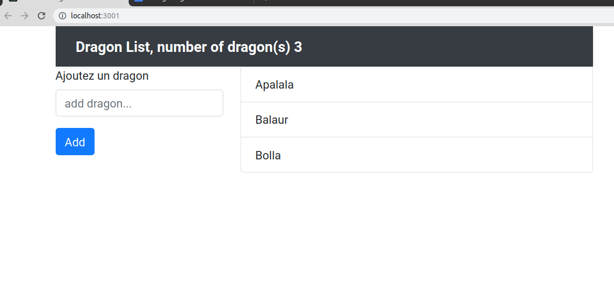

# Redux introduction

Rappelons que React est une librairie pour développer des interfaces utilisateurs. Dans ce sens les composants sont isolés, il n'est donc pas évident de partager les états des propriétés entre l'ensemble des composants dans l'application.

React propose la notion stable de context qui peut apporter des solutions. Mais pour une gestion plus complexe d'un state on utilisera de préférence Redux.

Redux fonctionne indépendemment de React et peut être utilisé seul. Avec Redux, on a comme avec le Context de React la notion de store, ce dernier est également **global**.

On pourra souscrire au state global, depuis n'importe quel composant, et récupérer les données du state en lecture seule. De même on pourra déclencher des actions depuis les composants afin de modifier le state global de Redux.

Redux impose un pattern au niveau de ses states. En effet,le state global sera notre source de vérité, à chaque fois qu'on voudra le changer on retournera une copie du state, sans toucher à la source de vérité.


## Présentation du reducer

**Redux c'est Reducer + flux ce qui donne Redux.**

Typiquement le reducer dans Redux est une fonction qui prend ses valeurs dans son state et les retourne modifiées, sans changer le state lui-même. Le pattern impose que pour des valeurs données le reducer retournera toujours le même état du state.

```js

let reducer = (state, action) => { /* return new state or state */}

```

## Principes du Pattern Redux

- Une unique source de vérité pour les states.
- Le state est en "read-only" (lecture seule).
- Les changements du state sont faits par des fonctions pures, aucun effet de bord; pour une valeur donnée on retournera toujours la même valeur.

## Installation

Tapez les lignes de code suivantes à la racine de votre projet :

```bash
npm install redux
npm install react-redux

# optionnelles ...
npm install --save-dev redux-devtools
```

Notez que vous pouvez également utiliser yarn pour installer ces dépendances. Faites cependant attention à ne pas mélanger les deux approches en particulier vérifier que vous n'avez pas deux fichiers yarn.lock et package-lock.json dans votre projet pour éviter les conflits.

### Exemple

Nous importerons tout d'abord **createStore** tout en haut de notre fichier.

```js
import { createStore } from 'redux';

// Définition de la source de vérité
let stateInit = {
    count : 0,
    questions : []
}

```

Puis nous définissons un reducer qui contiendra **la logique algorithmique** des changements du state. Notez que chaque modification du state se fait en fonction du paramètre **action.type**. Par défaut ces actions, constantes JS, sont écrites en majuscule :

```js

// Définition du Reducer
const questionsReducer = (state = stateInit, action = {}) => {

    // gestion des actions du Reducer
    switch(action.type){
        case 'ADD_QUESTION':
           
           // On doit retourner un nouveau state (sans toucher à la source de vérité)
            return { 
                ...state, 
                questions : questions.concat(action.question),
                count : state.count + 1
            };

        // Si aucun changement de state
        default:
            return state;
    }

}

export default questionsReducer;
```

## Précision JS pour la modification du state dans Redux

Nous rappelons ci-dessous comment faire une copie d'un objet. Vous devez le mettre en place dans Redux; le pattern impose des fonctions pures pour retourner la copie du state modifiée.

### Copie d'un objet en JS (pour des objets simples)

La technique ci-dessous ne marche pas si on a des objets dans des objets (références imbriquées).

```js
// source de vérité
const state = { a: 1, b: 2 };
// On veut modifier la valeur a dans la source de vérité
const deltaState = { a: 3};

// Copie du nouvel état sans modification du state (source de vérité)
const newState = { 
    ...state, 
    ...deltaState 
};

console.log(newState); // -> { a: 3, b: 2}

// En JS vous pouvez également écrire ceci
// pour créer une copie d'un objet
const nS = Object.assign({}, state, deltaState );
```

Nous allons maintenant créer le store et passer le reducer à ce dernier, la méthode getState nous retournera le contenu du store :

```js

import questionsReducer from 'questionsReducer';

// Création du store avec le reducer
const store = createStore(questionsReducer);

// état initial
console.log('state init', store.getSate());
```

La méthode dispatch permet de dispatcher une action et des données. C'est dans le reducer que la logique du changement des données aura lieu :

```js
// Dispatcher des données pour une action
store.dispatch({
    type : 'ADD_QUESTION',
    question : "Comment compiler React ?"
});

// REDUCER ...

// Le store a changé son state
console.log('new state', store.getSate());
```

### Subscribe

Pour écouter les changements du state on s'y abonnera à l'aide de la fonction subscribe du store, nous verrons plus tard un autre moyen pour récupérer le store de Redux dans les composants eux-mêmes.

```js
// s'abonner au store et écouter ses changements
store.subscribe(() => console.log(store.getState().questions) ) ;
```

## Exemple Redux

Voyez dans les sources un exemple de code Redux pour vous faire une idée de son utilisation fichier **example_redux.html**.

## Méthodes react-redux

Dans React nous pouvons globaliser le state de Redux et y accéder depuis n'importe quel composant.

Le module **react-redux** comporte un Hook spécial **useSelector** qui va faciliter l'accès au store pour lire le state de Redux (lecture seule). Il permet d'accèder à l'ensemble du store. Un deuxième Hook **useDispatch** permet d'envoyer une action spécifique au reducer.

### Mise en place de Redux dans React

Vous devez tout d'abord contextualiser l'application à l'aide du **Provider** de react-redux, c'est un préalable nécessaire pour se connecter au store.

```js
import { Provider } from 'react-redux';

const render = () => ReactDOM.render(
  <Provider store={store}>
    <App />
  </Provider>
  ,
  document.getElementById('root')
);

render();
```

Les Hooks permettent une approche simple de la lecture et l'écriture dans le store.

### Lecture useSelector

On utilise le Hook **useSelector**, celui-ci est écrit dans react-redux, qui est une méthode simple pour lire (read-only) le store de Redux. Dans un composant :

```js

import Reactfrom 'react';

// le module react-redux permettant de travailler avec Redux dans React
import { useSelector } from 'react-redux'; 


const Messages = (props) =>{
    
    // permet de lire le state par décomposition de votre reducer et de récupérer la variables messages
    /*
        newState = { messages : ["Hello message1"] ; count : 1 } 
    */
    const { messages } = useSelector(state => state) ;
    
    return(
        <ul>
            {messages.map((m, i ) => <li key={i} >{m}</li> ) }
        </ul>
    )
}
```
Remarque : la fonction de callback (arrow function) dans useSelector permet d'accéder avec toute la granulatité nécessaire à l'ensemble des reducers ... Nous verrons plus loin que nous pouvons agréger ou plus exactement combiner les reducers. Pour l'instant la fonction retourne tout le store :

```js
const { messages } = useSelector(state => state) ;
```

### Dispatcher une action dans le reducer

Si vous souhaitez dispatcher une action vous utiliserez le hook **useDispatch** suivant dans react-redux :

```js
import React from 'react';

// le module react-redux permettant de travailler avec Redux dans React
import { useSelector, useDispatch } from 'react-redux'; 

const Messages = (props) =>{
    const { messages, count } = useSelector(state => state) ;
    const dispatch = useDispatch();
    
    return(
      <>
        <ul>
            {messages.map((m, i ) => <li key={i} >{m}</li> ) }
        </ul>
        <p><button onClick={ () => dispatch({type : "ADD_MESSAGE", message : `Hello world ${count + 1}` }) } >Add message Hello + 1</button></p>
      </>
    )
}
```

## 01 Exercice Calculator

Créez un squelette d'application. Vous allez développer une calculatrice qui aura les fonctionnalités suivantes, utilisez Styled Components également pour gérer les styles css-in-js.

- addition

- multiplication

- reset, cette action permettra de remettre à jour les résultats.

Installez une nouvelle application calculatrice à l'aide de create-react-app (CRA).

Importez les dépendances Redux dans l'application :

```js
npm install redux
npm install react-redux
```

Puis créez un dossier **reducer** et un fichier dans ce dossier **calculatrice.js**.

src/reducer/calculatrice.js

Dans le contenu du fichier 

Fichier calculatrice.js (reducer)

```js

// source de vérité
const initialState = {
   // TODO
}

// Votre reducer calculatrice
export default (state = initialState, action = {}) => {

    // le switch travail avec le dispatch
    switch (action.type) {

        case 'ADDITION:

            return { ...state }

        default:
            return state;
    }
}
```

Dans le fichier index.js on contextualise le store de Redux afin d'y avoir accès dans la hiérarchie des composants.

```js
// ...
// Redux
import { createStore } from 'redux';
// Provider pour globaliser le store
import { Provider } from 'react-redux';

import reducer from './reducers/calculatrice';

const store = createStore(reducer);
ReactDOM.render(
<Provider store={store}>
    <App />
</Provider>
, document.getElementById('root'));

```

- Vous ferez tout le code dans le composant App.js, voyez le Wireframe suivant pour l'implémentation des fonctionnalités de cette calculatrice :

```txt

Number1 : []
Number2 : []

button Add
button Mult
button Reset

[Resultat]
```

Number1 et Number2 sont deux champs permettant de saisir les valeurs numériques de la calculatrice.

Vous implémenterez trois boutons permettant respectivement de faire l'addition, la multiplication ou de remettre dans l'état initial la calculatire (bouton Reset).

Le résultat de l'opération sera affiché sous les boutons dans la partie "Resultat".

Chaque action de votre calculatrice sera dispatchée au reducer et vous vous connecterez au store pour récupérer le résultat.

Pensez à utiliser **connect** pour utiliser les fonctions de lecture et de dispatch de Redux dans ce composant.

## 02 Exercice Liste de Dragons Mise en place

Nous partirons d'un squelette d'application (create-react-app CRA) qui permettra d'ajouter/supprimer des dragons d'une liste définie.

Organisation des dossiers pour Redux. Dans le dossier constantes le fichier actions.js contiendra l'ensemble des constantes d'action. Dans le dossier actions le fichier actions-types contiendra l'ensemble des types d'actions passées aux fonctions du dispatcher. Et le dossier reducers contiendra l'ensemble des reducers, ici vous n'avez qu'une seule reducer pour cet exercice.

```txt

reducers/
    dragon.js

constants/
    actions.js.  <--- les constantes export const ADD_DRAGON = "ADD_DRAGON" ; ...

actions/
    actions-types.js. <--- factoriser les actions du dispatcher dans une fonction, par add_dragon pour les écrire dans le code : dispatch( add_dragon( dragon ) )

```

Fichier constantes actions.js. On les utilise dans actions-types et dans le reducer.

```js
export const ADD_DRAGON = 'ADD_DRAGON';
// TODO ...
```

Fichier actions-types.js, factoriser le code dans le dispatch

```js
import { ADD_DRAGON } from '../constants/actions';

// payload correspond à ce que vous allez passer comme valeur à votre action { ... name : "Super dragon", force : 10 }
export const addDragon = payload => {
    return {
        type: ADD_DRAON, payload
    }
};
```

Notez que lorsque vous allez accéder aux valeurs dans vos action dans le reducer avec payload :

```js

const { name, force } = action.payload;

```

Utilisez ces constantes dans l'exercice.

### Reducer

Dans le fichier dragons.js

**Le reducer contient la logique qui s'appliquera sur les données du store, chaque modification des states conduira à la création d'un nouvel état.**

Voici le code du reducer que nous allons mettre en place :

```js
import { ADD_DRAGON } from '../constants/actions';

// initialisation des states : SOURCE DE VERITE
let stateInit = {
    dragons: [
        "Apalala",
        "Balaur",
        "Bolla"],
    count: 0
}

let reducerDragon = (state = stateInit, action = {}) => {
    switch (action.type) {
        case ADD_DRAGON:
            // TODO

            return { ...state, elems }

        default:
            return state;
    }

    return state
}

export default reducerDragon;
```

Affichez la liste des dragons dans la colonne de droite :



\newpage

### Partie 1 ajout d'un dragon

Rendez fonctionnel l'ajout du dragon. Puis utilisez Redux pour mettre à jour la liste des dragons dans la colonne de droite.

Faites en sorte que l'incrémentation du nombre de dragons se fasse également dans une barre de navigation (voyez l'image précédente).

Gérez les erreurs lors de l'insertion d'un dragon (champ vide, insertion d'un même dragon interdit).

Vous afficherez dans la barre de navigation le nombre de dragon(s) dans le store (voir le wireframe).

### Partie 2 suppression d'un dragon

Vous allez maintenant ajouter la fonctionnalité de suppression d'un dragon. Faites attention à bien nommer vos actions (convention de nommage).

### Partie 3 inversion de la liste des dragons

Ajoutez un bouton dans l'application qui permet d'inverser l'ordre d'affichage de la liste des dragons. Placez ce bouton en-dessous du bouton de l'ajout des dragons.
